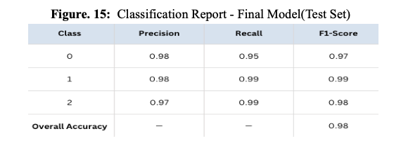
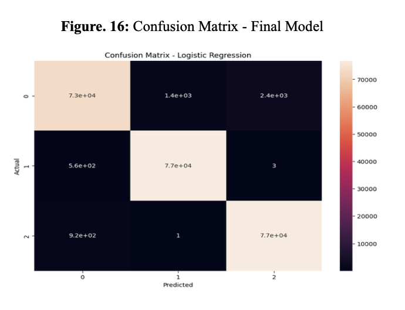
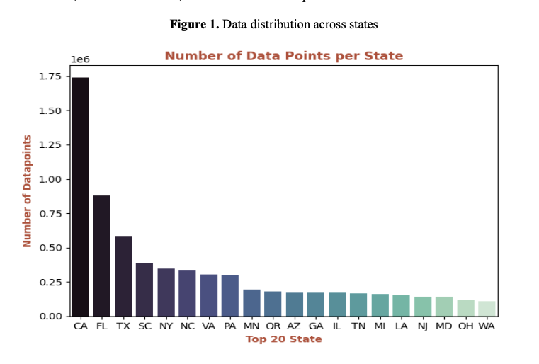
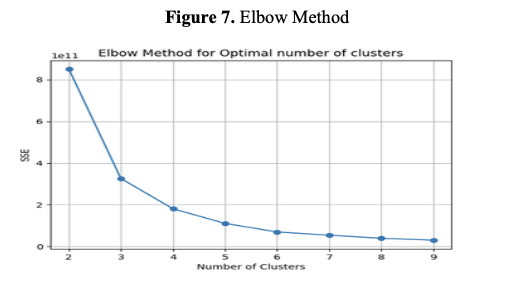
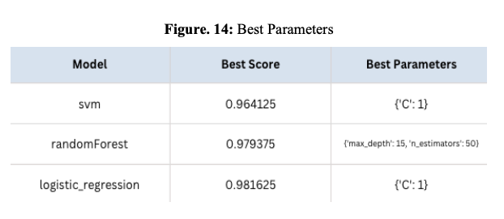
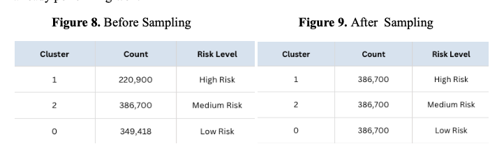

# TripSafe: Traffic Accident Risk Prediction


A machine learning model that predicts traffic accident risk levels (Low, Medium, High) based on location, time, and weather conditions to enable safer travel planning.


##  Project Overview

TripSafe addresses the critical need for predictive road safety insights by analyzing historical traffic accident data. Unlike existing navigation apps that only provide real-time traffic updates, TripSafe offers proactive risk assessment to help drivers make informed travel decisions.

### Key Features
- **Risk Level Prediction**: Classifies accident risk as Low, Medium, or High
- **Multi-factor Analysis**: Considers location, time, weather, and historical patterns
- **High Accuracy**: 98% accuracy with balanced precision across all risk categories
- **Lightweight Models**: Fast inference suitable for real-time applications
- **California-focused**: Optimized for California's comprehensive accident dataset

## 🏆 Results

Our final Logistic Regression model achieved:
- **Test Accuracy**: 98%
- **Train Accuracy**: 98%
- **Test Loss**: 0.0526
- **Train Loss**: 0.0426
- **Silhouette Score**: 0.644 (clustering quality)




## 📊 Dataset

- **Source**: US Accidents (2016-2023) dataset from Kaggle
- **Original Size**: 7.7+ million records, 48 columns
- **Final Dataset**: ~950K California records, 122 features after preprocessing
- **Geographic Focus**: California (highest data density for better model reliability)



## 🔄 Methodology

### Data Pipeline
```
Raw Data → Bash Cleaning → Python Processing → Feature Engineering → 
PCA Reduction → K-Means Clustering → SMOTE Sampling → Classification
```

### 1. Data Preprocessing
- **Initial Cleaning**: Bash scripts for exploratory analysis and column reduction
- **Missing Value Handling**: Mode for categorical, mean/median for numerical
- **Outlier Removal**: Eliminated invalid values (temp >140°F, wind speed >200mph)
- **Categorical Encoding**: One-hot encoding with cardinality reduction


### 2. Feature Engineering
Created meaningful features from raw timestamp and location data:
- `Day_of_Week`: Weekend vs weekday patterns
- `Duration_Minutes`: Accident duration as severity indicator
- `Is_Rush_Hour`: Peak traffic hours (7-9 AM, 4-7 PM)
- `Is_Holiday`: Holiday flag for pattern recognition
- `Accident_Density`: County-level accident frequency

### 3. Clustering for Target Creation
Due to severe class imbalance in the original severity column (75% Severity 2), we implemented K-Means clustering:
- **Optimal Clusters**: 3 (determined by elbow method)
- **Features Used**: All except original severity to avoid bias
- **Risk Level Assignment**: Based on mean severity, duration, and accident density



### 4. Dimensionality Reduction
- **Method**: Principal Component Analysis (PCA)
- **Variance Retained**: 98%
- **Components**: 48 (reduced from 122 original features)
- **Benefits**: Faster training, reduced overfitting risk


### 5. Model Selection & Training
Tested multiple algorithms with GridSearchCV:

| Model | Best Parameters | Train Loss | Test Loss | Selected |
|-------|----------------|------------|-----------|----------|
| Logistic Regression | C=1 | 0.0426 | 0.0526 | ✅ |
| Random Forest | max_depth=15, n_estimators=50 | 0.1005 | 0.1244 | ❌ |
| SVM | Various kernels tested | - | - | ❌ |




## 🔍 Technical Details

### Clustering Quality
- **Silhouette Score**: 0.644 (>0.5 indicates good separation)
- **Risk Level Distribution**: Balanced after SMOTE oversampling
- **Validation**: Cross-validated cluster stability

### Model Performance
- **Cross-validation**: 5-fold CV for robust evaluation
- **Overfitting Check**: Nearly identical train/test accuracy
- **Class Balance**: High precision/recall across all risk levels


## 🎯 Business Applications

### Potential Integration
- **Navigation Platforms**: Google Maps, Apple Maps risk warnings
- **Fleet Management**: Logistics companies for route optimization
- **Insurance**: Risk-based premium calculations
- **Urban Planning**: Traffic safety infrastructure decisions

### Value Proposition
- **Proactive Safety**: Prevent accidents through early warning
- **Cost Reduction**: Lower insurance claims and emergency response
- **Efficiency**: Optimized routing reduces travel time and fuel costs

## 🔬 Future Improvements

1. **Enhanced Clustering**: Experiment with DBSCAN, Gaussian Mixture Models
2. **Real-time Integration**: Stream processing for live risk updates
3. **Multi-state Expansion**: Extend beyond California
4. **Deep Learning**: Investigate CNN/RNN for spatial-temporal patterns
5. **External Data**: Incorporate construction zones, events, traffic volume


## 🌐 Links
* 📂 [Project Report (PDF)](docs/TripSafeReport.pdf)
* 🔬 [TripSafe Demo](https://tripsafe-demo.com) (Coming Soon)
* 🔗 [Dataset on Kaggle](https://www.kaggle.com/datasets/sobhanmoosavi/us-accidents)

## 📚 References

- Girija, M., & Divya, V. (2024). Deep learning-based traffic accident prediction: An investigative study for enhanced road safety
- US Accidents Dataset (2016-2023) - Kaggle
- Scikit-learn: Machine Learning in Python, Pedregosa et al., JMLR 12, pp. 2825-2830, 2011


---
